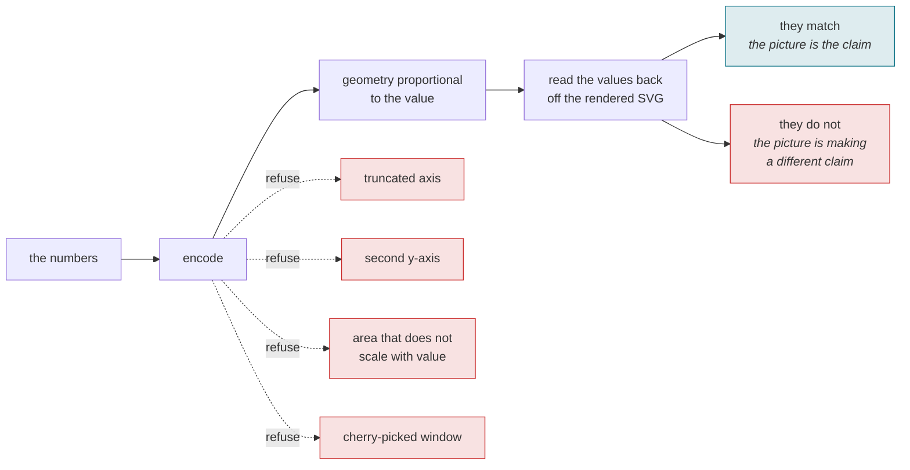
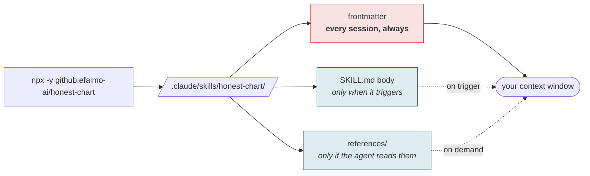
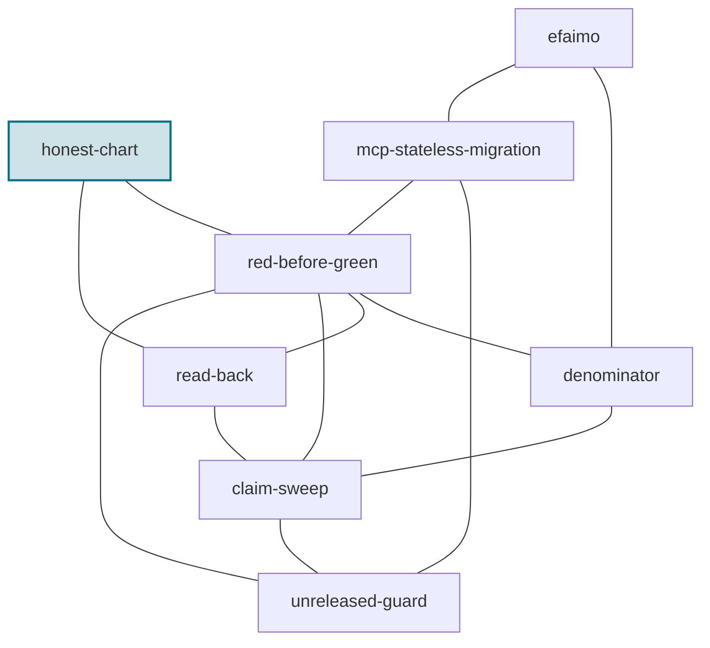

# honest-chart

[](LICENSE)
[-0b7285)](https://efaimo.ai/skills)
[](https://github.com/efaimo-ai/honest-chart/actions/workflows/house-style.yml)

An Agent Skill for turning data into a chart that says what the data says, and
proving it did.

A chart is a claim: that the picture is proportional to the numbers. It is a
checkable claim, and it is almost never checked. This skill makes an agent build
the visualization so its geometry is derived from the data, refuse the handful
of ways charts routinely mislead, and then verify the finished chart by reading
its values back off the render.

<!-- generated:install -->

## Install

```sh
# into ./.claude/skills/honest-chart/
npx -y github:efaimo-ai/honest-chart

# into ~/.claude/skills/honest-chart/, for every project
npx -y github:efaimo-ai/honest-chart --global

# installed already, and still current?
npx -y github:efaimo-ai/honest-chart --check
```

That is the repository, not the registry, and it is deliberate: `honest-chart` is
not on npm yet, and a README that prints `npx honest-chart` today would be
advertising a command that 404s. The line above works right now. The day the
package publishes it becomes `npx honest-chart`, and this README is regenerated from
a committed registry probe rather than from anybody's memory.

The package is the skill: `SKILL.md` and its `references/`, nothing else. The
installer copies them, reads every byte back, and fails if what landed is not
what it wrote. It refuses to overwrite a directory whose contents differ unless
you pass `--force`, and installing the same version twice is a success rather
than a conflict.

Or take it by hand. It is markdown; `npx -y github:efaimo-ai/honest-chart --print` writes `SKILL.md` to
stdout, and the repository is the whole thing.

<!-- /generated:install -->

## Encode, then read it back



The read-back is what makes it a check rather than a style guide. A chart you
have not read the numbers back off is a claim you have not verified.

## The problem

Every number in a chart can be correct while the chart is false. A bar axis that
starts at 70 makes a 72-vs-78 gap look 4x (the bars are 2 and 8 units tall). A
second y-axis manufactures a
correlation from two unrelated series. A bubble sized by radius makes a doubling
look like a quadrupling. The data is right; the geometry lies; the reader takes
away a ratio that is not there.

The usual advice for this is a list of do-nots. This skill adds the move that
actually catches the lie: an SVG is measurable text, so you read the encoded
values back out of the rendered chart and confirm they match the source. A chart
you have not read back is an unverified claim.

## Install

Claude Code and other agents that read `SKILL.md` from a skills directory:

```bash
git clone --depth 1 https://github.com/efaimo-ai/honest-chart \
  ~/.claude/skills/honest-chart
```

Or vendor the directory anywhere your agent loads skills from. There is nothing
to build and no dependencies.

## What it contains

| file | what it is |
|---|---|
| `SKILL.md` | the three moves - encode honestly, refuse the lies, read it back |
| `references/encodings.md` | the chart for the data's shape, and how to build it as clean self-contained SVG |
| `references/lies.md` | the specific ways charts mislead, each with its fix |
| `references/read-back.md` | how to measure the values back out of a rendered chart to verify it |

`SKILL.md` is small on purpose: it is what an agent loads at trigger time. The
references load only when a chart actually needs them.

## When it fires

You are asked to visualize data, draw a chart or graph, build a dashboard or an
SVG figure of numbers, or present a result as a picture. Before you show it, you
make the geometry proportional to the data and read it back to prove it.

## The part worth reading even if you never install it

A chart is the one deliverable people trust without checking, because checking it
feels like doubting arithmetic. But the arithmetic is not where charts fail;
the geometry is. The cheapest guard against a chart that lies is to measure the
picture: take the bar heights and the pie angles back out of the render and see
whether they carry the numbers you put in. If they do not, the chart was going
to mislead someone, and now it will not.

## Scope

This is a discipline, not a charting library. There is nothing to run.

It does not decide whether data is worth showing, or design the prettiest
possible chart. It makes sure the chart does not misstate the data, and that you
can prove it does not.


<!-- generated:pipeline -->

## What installing it does to a session

A skill is not free just because it is markdown. Its frontmatter is loaded at
the start of every session for every skill you have installed, whether or not it
ever fires.



In this skill's case, measured by [efaimo](https://github.com/efaimo-ai/efaimo) `weigh` (v0.5.0, 2026-09-04):
**91 tokens always resident**, 923 when it triggers, 2,391 across 3 reference files if the agent reads to the end.

<!-- /generated:pipeline -->

<!-- generated:set -->

## The set

Every skill in this set is about a report that was true about the wrong thing.

| skill | something reported | what the report was really about |
|---|---|---|
| [`red-before-green`](https://github.com/efaimo-ai/red-before-green) | a check said clean | whether it ran at all |
| [`denominator`](https://github.com/efaimo-ai/denominator) | a check said clean | how much of the world it saw |
| [`read-back`](https://github.com/efaimo-ai/read-back) | a write said done | whether it applied |
| [`claim-sweep`](https://github.com/efaimo-ai/claim-sweep) | a change said done | everything else still asserting the old value |
| [`unreleased-guard`](https://github.com/efaimo-ai/unreleased-guard) | a document said true | which version it is true of |
| **`honest-chart`** | a picture said the data | whether its geometry is proportional |
| [`mcp-stateless-migration`](https://github.com/efaimo-ai/mcp-stateless-migration) | a server said ok | which revision it speaks |
| [`efaimo`](https://github.com/efaimo-ai/efaimo) | a tool said A(100) | what a grade certifies, and what it costs |



Each edge is a real handoff, not a category: the reason one skill points at
another is written into it at [efaimo.ai/skills](https://efaimo.ai/skills), and
in the `Siblings` section of every `SKILL.md`. All of them are graded and
weighed by [`efaimo`](https://github.com/efaimo-ai/efaimo), the CLI that measures
what an agent loads.

<!-- /generated:set -->

## License

Apache-2.0. See [`LICENSE`](LICENSE) and [`NOTICE`](NOTICE).
