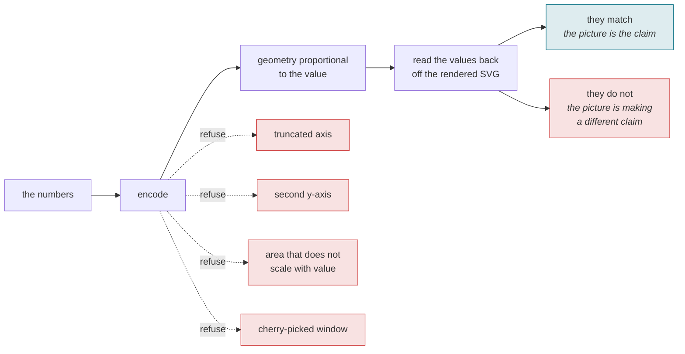

# honest-chart

[](LICENSE)
[-0b7285)](https://efaimo.ai/skills)
[](https://github.com/efaimo-ai/honest-chart/actions/workflows/house-style.yml)

An Agent Skill for turning data into a chart that says what the data says, and
proving it did.

A chart is a claim: that the picture is proportional to the numbers. It is a
checkable claim, and it is almost never checked. This skill makes an agent build
the visualization so its geometry is derived from the data, refuse the handful
of ways charts routinely mislead, and then verify the finished chart by reading
its values back off the render.

## Encode, then read it back



The read-back is what makes it a check rather than a style guide. A chart you
have not read the numbers back off is a claim you have not verified.

## The problem

Every number in a chart can be correct while the chart is false. A bar axis that
starts at 70 makes a 72-vs-78 gap look 4x (the bars are 2 and 8 units tall). A
second y-axis manufactures a
correlation from two unrelated series. A bubble sized by radius makes a doubling
look like a quadrupling. The data is right; the geometry lies; the reader takes
away a ratio that is not there.

The usual advice for this is a list of do-nots. This skill adds the move that
actually catches the lie: an SVG is measurable text, so you read the encoded
values back out of the rendered chart and confirm they match the source. A chart
you have not read back is an unverified claim.

## Install

Claude Code and other agents that read `SKILL.md` from a skills directory:

```bash
git clone --depth 1 https://github.com/efaimo-ai/honest-chart \
  ~/.claude/skills/honest-chart
```

Or vendor the directory anywhere your agent loads skills from. There is nothing
to build and no dependencies.

## What it contains

| file | what it is |
|---|---|
| `SKILL.md` | the three moves - encode honestly, refuse the lies, read it back |
| `references/encodings.md` | the chart for the data's shape, and how to build it as clean self-contained SVG |
| `references/lies.md` | the specific ways charts mislead, each with its fix |
| `references/read-back.md` | how to measure the values back out of a rendered chart to verify it |

`SKILL.md` is small on purpose: it is what an agent loads at trigger time. The
references load only when a chart actually needs them.

## When it fires

You are asked to visualize data, draw a chart or graph, build a dashboard or an
SVG figure of numbers, or present a result as a picture. Before you show it, you
make the geometry proportional to the data and read it back to prove it.

## The part worth reading even if you never install it

A chart is the one deliverable people trust without checking, because checking it
feels like doubting arithmetic. But the arithmetic is not where charts fail;
the geometry is. The cheapest guard against a chart that lies is to measure the
picture: take the bar heights and the pie angles back out of the render and see
whether they carry the numbers you put in. If they do not, the chart was going
to mislead someone, and now it will not.

## Scope

This is a discipline, not a charting library. There is nothing to run.

It does not decide whether data is worth showing, or design the prettiest
possible chart. It makes sure the chart does not misstate the data, and that you
can prove it does not.


## The set

Seven skills, each one a discipline that cost something to learn.

| skill | the question it asks |
|---|---|
| [`red-before-green`](https://github.com/efaimo-ai/red-before-green) | can this check fail at all? |
| [`denominator`](https://github.com/efaimo-ai/denominator) | how much of the world can it see? |
| [`read-back`](https://github.com/efaimo-ai/read-back) | did the write actually apply? |
| [`claim-sweep`](https://github.com/efaimo-ai/claim-sweep) | what else still asserts the old value? |
| [`unreleased-guard`](https://github.com/efaimo-ai/unreleased-guard) | does the copy describe what shipped? |
| **`honest-chart`** (this one) | is the picture proportional to the data? |
| [`mcp-stateless-migration`](https://github.com/efaimo-ai/mcp-stateless-migration) | does this server match the 2026-07-28 spec? |

All of them are audited by [`efaimo`](https://github.com/efaimo-ai/efaimo), the
CLI that measures the quality and context-window cost of MCP servers and Agent
Skills. The index of every public skill it can find, graded, is at
[efaimo.ai/skills](https://efaimo.ai/skills).

## License

Apache-2.0. See [`LICENSE`](LICENSE) and [`NOTICE`](NOTICE).
